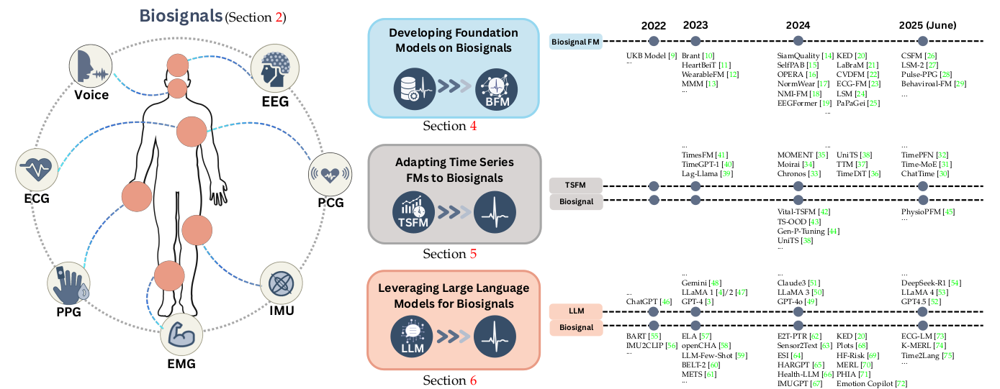

#  Awesome Foundation Models for Biosignals [](https://awesome.re) [](https://github.com/guxiao0822/awesome-biosignal-foundation-model/pulls)


Biosignals like ECG, EEG, and PPG capture the body's physiological and behavioural "languages", but analyzing them at scale requires dedicated approaches. Foundation models, which have transformed NLP and computer vision, are now emerging for biosignal analysis, promising to unlock patterns across vast amounts of sensor readings.

This curated list covers **foundation models (FMs), datasets, and tools for biosignals** based on our comprehensive survey of the field.

> **📚 Survey Paper**: [Foundation Models for Biosignals: A Survey](https://www.techrxiv.org/users/953631/articles/1322825/master/file/data/25_BFM_Survey/25_BFM_Survey.pdf?inline=true#scrollbar=1&toolbar=1&statusbar=1&navpanes=1%23&page=1.00&gsr=0) - A comprehensive review of foundation model development and applications for biosignals.


## 🗺️ Landscape of Biosignal Foundation Models

**timeline marked by the first online date of each work*

The field of biosignal foundation models can be organized into three converging directions:
1. **Pretraining Biosignal FMs from Scratch**: Pretraining dedicated foundation models on large biosignal corpora
2. **Adapting Time Series FMs to Biosignals**: Repurposing general time series foundation models to biosignal tasks
3. **Leveraging LLMs for Biosignals**: Leverage (multi-modal) large language models for biosignal analysis

## 📌 Table of Contents

- [🗺️ Landscape](#-landscape-of-biosignal-foundation-models)
- [📚 Surveys & Reviews](#-surveys--reviews)
- [🔬 Datasets & Benchmarks & Tools](#-datasets--benchmarks--tools)
  - [Large-Scale Training Datasets](#large-scale-training-datasets)
  - [Evaluation Benchmarks](#evaluation-benchmarks)
  - [Preprocessing Toolboxes and Packages](#preprocessing-toolboxes-and-packages)
- [🏗️ Pretraining Biosignal Foundation Models from Scratch](#-pretraining-biosignal-foundation-models-from-scratch)
- [🔄 Adapting Time Series Foundation Models to Biosignals](#-adapting-time-series-foundation-models-to-biosignals)
- [🤖 Leveraging Large Language Models for Biosignal Analysis](#-leveraging-large-language-models-for-biosignal-analysis)
- [‼️ Open Challenges](#-open-challenges)
- [🤝 Contributing](#-contributing)

## 📚 Surveys & Reviews

- **[IEEE TPAMI, 2025]** Foundation models defining a new era in vision: a survey and outlook [[paper]](https://arxiv.org/abs/2307.13721)
- **[ACM SIGKDD, 2024]** Foundation models for time series analysis: a tutorial and survey [[paper]](https://arxiv.org/abs/2403.14735)
- **[Arxiv, 2024]** A survey of time series foundation models: generalizing time series representation with large language mode [[paper]](https://arxiv.org/abs/2405.02358)
- **[Arxiv, 2024]** Biomedical foundation model: a survey [[paper]](https://arxiv.org/abs/2503.02104)
- **[Arxiv, 2024]** Deep time series models: a comprehensive survey and benchmark [[paper]](https://arxiv.org/abs/2407.13278)
- **[Arxiv, 2024]** Foundation models for video understanding: a survey [[paper]](https://arxiv.org/abs/2405.03770)
- **[IJCAI, 2024]** Large language models for time series: a survey [[paper]](https://arxiv.org/abs/2402.01801)

## 🔬 Datasets & Benchmarks & Tools


- `ECG` - Electrocardiography (heart electrical activity)
- `EEG` - Electroencephalography (brain electrical activity)  
- `PPG` - Photoplethysmography (blood volume changes)
- `IMU` - Inertial Measurement Unit (motion sensors)
- `EMG` - Electromyography (muscle electrical activity)
- `ABP` - Arterial Blood Pressure
- `PCG` - Phonocardiography (heart sounds)
- `Resp` - Respiration/Respiratory signals (breathing patterns)

### Large-Scale Training Datasets

| Dataset | Modality | # Individuals | # Duration (hr) | Link |
|---------|----------|-------------|---------------|------|
| **UKBiobank** | `ECG` `PPG` `IMU` `Health Metrics` | - | - | [[dataset]](https://www.ukbiobank.ac.uk/) |
| **MC-MED** | `ECG` `PPG` `Resp` `Vital Signs` | 70K | - | [[dataset]](https://physionet.org/content/mc-med/1.0.0/) |
| **MIMIC-III-WDB** | `ECG` `PPG` `ABP` `Resp` `Vital Signs` | 30K | 3M | [[dataset]](https://physionet.org/content/mimic3wdb/1.0/) |
| **VitalDB** | `ECG` `PPG` `ABP` `Resp` `Vital Signs` | 6K | - | [[dataset]](https://vitaldb.net/dataset/) |
| **PulseDB** | `ECG` `PPG` `ABP` | 5K | 50M | [[dataset]](https://github.com/pulselabteam/PulseDB) |
| **MESA** | `ECG` `PPG` `EEG` | 2K | - | [[dataset]](https://www.sleepdata.org/datasets/mesa) |
| **VTaC** | `ECG` `PPG` `ABP` | 2K | - | [[dataset]](https://physionet.org/content/vtac/) |
| **CODE** | `ECG` | 2M | - | [[dataset]](https://figshare.scilifelab.se/articles/dataset/CODE_dataset/15169716) |
| **MIMIC-IV-ECG** | `ECG` | 160K | 2K | [[dataset]](https://physionet.org/content/mimic-iv-ecg/1.0/) |
| **PhysioNet2020** | `ECG` | 40K | 90 | [[dataset]](https://physionet.org/content/challenge-2020/1.0.2/) |
| **eICU** | `Vital Signs` | 139K | - | [[dataset]](https://eicu-crd.mit.edu/) |
| **HiRID** | `Vital Signs` | 34K | - | [[dataset]](https://physionet.org/content/hirid/) |
| **UCSF-PPG** | `PPG` | 21K | 600K | [[dataset]](https://tison.ucsf.edu/ppg-diabetes) |
| **TUEG** | `EEG` | 15K | 27K | [[dataset]](https://isip.piconepress.com/projects/tuh_eeg/) |
| **HBN-EEG** | `EEG` | 3K | 3K | [[dataset]](https://neuromechanist.github.io/data/hbn/) |
| **MOABB** | `EEG` | >1K | - | [[dataset]](https://moabb.neurotechx.com/) |
| **SEED Series** | `EEG` `Gaze Metrics` | - | - | [[dataset]](https://bcmi.sjtu.edu.cn/home/seed) |
| **emg2pose** | `EMG` | 193 | 370 | [[dataset]](https://github.com/facebookresearch/emg2pose) |
| **emg2qwerty** | `EMG` | 108 | 346 | [[dataset]](https://github.com/facebookresearch/emg2qwerty) |
| **HUNT4** | `IMU` | 35K | - | [[dataset]](https://github.com/ntnu-ai-lab/SelfPAB) |
| **Capture24** | `IMU` | 151 | 4K | [[dataset]](https://github.com/OxWearables/capture24) |
| **Ego4D** | `IMU` `Audio` `Gaze Metrics` | 923 | 4K | [[dataset]](https://ego4d-data.org/) |
| **COVID-19 Sounds** | `Audio` | 36K | 552 | [[dataset]](https://www.covid-19-sounds.org/en/blog/neurips_dataset.html) |

### Evaluation Benchmarks

- **PhysioNet Challenges**: Annual international competitions providing standardized evaluation frameworks for various biosignal analysis tasks including ECG interpretation, sleep staging, and arrhythmia detection [[benchmark]](https://physionet.org/challenge/)

- **MOABB** (Mother of All BCI Benchmarks): Comprehensive benchmarking framework for EEG-based brain-computer interface algorithms with standardized pipelines and evaluation protocols [[benchmark]](https://moabb.neurotechx.com/)

### Preprocessing Toolboxes and Packages

| Toolbox/Package  | Modality | Link |
|------------------|----------|------|
| **MNE-Python**   | `EEG`| [[tool]](https://mne.tools/stable/) |
| **NeuroKit**     | `ECG` `PPG` `Resp` `EMG` | [[tool]](https://github.com/neuropsychology/NeuroKit) |
| **HeartPy**      | `ECG` `PPG` | [[tool]](https://python-heart-rate-analysis-toolkit.readthedocs.io/en/latest/) |
| **pyHRV**        | `ECG` `PPG` | [[tool]](https://pyhrv.readthedocs.io/en/latest/) |
| **BIOBSS**       | `ECG` `PPG` `IMU` | [[tool]](https://github.com/obss/BIOBSS) |
| **BioSPPy**      | `ECG` `PPG` `EEG` `Resp` `EMG` `PCG` | [[tool]](https://github.com/scientisst/BioSPPy) |
| **PyPhysio**     | `ECG` `PPG` `IMU` | [[tool]](https://gitlab.com/a.bizzego/pyphysio) |
| **EEGLAB**       | `EEG` | [[tool]](https://eeglab.org/) |
| **Vital-Sqi**    | `ECG` `PPG` | [[tool]](https://github.com/meta00/vital_sqi) |
| **PhysioKit**    | `PPG` `Resp` | [[tool]](https://github.com/PhysiologicAILab/PhysioKit) |
| **PPGFeat**      | `PPG` | [[tool]](https://github.com/saadsur/PPGFeat) |
| **WFDB Toolbox** | `ECG` `PPG` `EEG` `Resp` `ABP` `EMG` | [[tool]](https://physionet.org/content/wfdb-matlab/0.10.0/) |
| **PyPPG**        | `PPG` | [[tool]](https://pyppg.readthedocs.io/) |
## 🏗️ Pretraining Biosignal Foundation Models from Scratch
<!-- Badge Definitions -->
[ECG]: 
[EEG]: 
[PPG]: 
[IMU]: 
[EMG]: 

*Building dedicated foundation models using large biosignal corpora*
- **[Arxiv. 2025]** CLEF : Clinically-Guided Contrastive Learning for Electrocardiogram Foundation Modelss  [[paper]](https://www.arxiv.org/abs/2512.02180) [[code]](https://github.com/Nokia-Bell-Labs/ecg-foundation-model)
- **[NEJM AI. 2025]** An Electrocardiogram Foundation Model Built on over 10 Million Recordings with External Evaluation across Multiple Domains  [[paper]](https://www.ovid.com/journals/neai/abstract/10.1056/aioa2401033~an-electrocardiogram-foundation-model-built-on-over-10?redirectionsource=fulltextview) [[code]](https://github.com/PKUDigitalHealth/ECGFounder)
- **[JAMIA Open, 2025]** ECG-FM: An Open Electrocardiogram Foundation Model  [[paper]](https://academic.oup.com/jamiaopen/article/8/5/ooaf122/8287827) [[code]](https://github.com/bowang-lab/ECG-FM/)
- **[Arxiv, 2025]** BenchECG and xECG: a benchmark and baseline for ECG foundation models  [[paper]](https://arxiv.org/abs/2509.10151) [[code]](https://github.com/dlaskalab/bench-xecg/)
- **[Arxiv, 2025]** Sensing Cardiac Health Across Scenarios and Devices: A Multi-Modal Foundation Model Pretrained on Heterogeneous Data from 1.7 Million Individuals   [[paper]](https://arxiv.org/abs/2507.01045)
- **[Arxiv, 2025]** ProtoECGNet: Case-Based Interpretable Deep Learning for Multi-Label ECG Classification with Contrastive Learning  [[paper]](https://arxiv.org/abs/2504.08713) [[code]](https://github.com/bbj-lab/protoecgnet)
- **[Arxiv, 2025]** OpenECG: Benchmarking ECG Foundation Models with Public 1.2 Million Records  [[paper]](https://arxiv.org/abs/2503.00711)
- **[NeurIPS, 2025]** SensorLM: Learning the Language of Wearable Sensors  [[paper]](https://arxiv.org/abs/2506.09108)
- **[NeurIPS, 2025]** PhysioWave: A Multi-Scale Wavelet-Transformer for Physiological Signal Representation   [[paper]](https://arxiv.org/abs/2506.10351) [[code]](https://github.com/ForeverBlue816/PhysioWave) 
- **[NeurIPS, 2025]** BrainOmni: A Brain Foundation Model for Unified EEG and MEG Signals   [[paper]](https://arxiv.org/abs/2505.18185) [[code]](https://github.com/OpenTSLab/BrainOmni) 
- **[NeurIPS, 2025]** NeurIPT: Foundation Model for Neural Interfaces  [[paper]](https://arxiv.org/abs/2510.16548) [[code]](https://github.com/ZzzitaoFang/NeurIPT) 
- **[NeurIPS, 2025]** LUNA: Efficient and Topology-Agnostic Foundation Model for EEG Signal Analysis  [[paper]](https://arxiv.org/abs/2510.22257) [[code]](https://github.com/pulp-bio/biofoundation) 
- **[ICML, 2025]** EEG-Language Pretraining for Highly Label-Efficient Clinical Phenotyping  [[paper]](https://openreview.net/pdf?id=yaI2ZYFmeD) [[code]](https://github.com/SamGijsen/ELM) 
- **[ICML, 2025]** From Token to Rhythm: A Multi-Scale Approach for ECG-Language Pretraining  [[paper]](https://openreview.net/forum?id=fUjkoGUre0) [[code]](https://github.com/HKU-MedAI/MELP)
- **[ICML, 2025]** Boosting Masked ECG-Text Auto-Encoders as Discriminative Learners  [[paper]](https://openreview.net/pdf?id=mM65b81LdM) [[code]]( https://github.com/manhph2211/D-BETA)
- **[ICML, 2025]** Beyond Sensor Data: Foundation Models of Behavioral Data from Wearables Improve Health Predictions [[paper]](https://openreview.net/forum?id=DtVVltU1ak) 
- **[Nature, 2025]** A generic noninvasive neuromotor interface for human-computer interaction  [[paper]](https://www.nature.com/articles/s41586-025-09255-w) [[code]](https://github.com/facebookresearch/generic-neuromotor-interface)
- **[UbiComp, 2025]** Pulse-PPG: An Open-Source Field-Trained PPG Foundation Model for Wearable Applications Across Lab and Field Settings  [[paper]](https://arxiv.org/abs/2502.01108) [[code]](https://github.com/maxxu05/pulseppg)
- **[ICLR, 2025]** CBraMod: A Criss-Cross Brain Foundation Model for EEG Decoding  [[paper]](https://arxiv.org/abs/2412.07236) [[code]](https://github.com/wjq-learning/CBraMod)
- **[ICLR, 2025]** Reading Your Heart: Learning ECG Words and Sentences via Pre-training ECG Language Model*  [[paper]](https://arxiv.org/abs/2502.10707) [[code]](https://github.com/PKUDigitalHealth/HeartLang)
- **[ICLR, 2025]** NeuroLM: A Universal Multi-task Foundation Model for Bridging the Gap between Language and EEG Signals  [[paper]](https://openreview.net/pdf?id=Io9yFt7XH7) [[code]](https://github.com/935963004/NeuroLM)
- **[ICLR, 2025]** PaPaGei: Open Foundation Models for Optical Physiological Signals  [[paper]](https://arxiv.org/abs/2410.20542) [[code]](https://github.com/nokia-bell-labs/papagei-foundation-model)
- **[ICLR, 2025]** RelCon: Relative Contrastive Learning for a Motion Foundation Model for Wearable Data  [[paper]](https://openreview.net/pdf?id=k2uUeLCrQq) [[code]](https://github.com/maxxu05/relcon)
- **[SPI Health Data Science, 2025]** ECG-LM: Understanding Electrocardiogram with a Large Language Model  [[paper]](https://arxiv.org/abs/2410.20542)
- **[NPJ Digital Medicine, 2024]** Self-supervised learning for human activity recognition using 700,000 person-days of wearable data  [[paper]](https://www.nature.com/articles/s41746-024-01062-3) [[code]](https://github.com/OxWearables/ssl-wearables)
- **[NPJ Cardiovascular Health, 2024]** Foundation models for cardiovascular disease detection via biosignals from digital stethoscopes   [[paper]](https://www.nature.com/articles/s44325-024-00027-5.pdf)
- **[Cell Reports Medicine, 2024]** Foundation model of ECG diagnosis: Diagnostics and explanations of any form and rhythm on ECG  [[paper]](https://www.cell.com/cell-reports-medicine/pdfExtended/S2666-3791(24)00646-3)
- **[NeurIPS, 2024]** Towards Open Respiratory Acoustic Foundation Models: Pretraining and Benchmarking  [[paper]](https://arxiv.org/pdf/2406.16148) [[code]](https://github.com/evelyn0414/OPERA)
- **[ICLR, 2024]** Large-scale Training of Foundation Models for Wearable Biosignals   [[paper]](https://arxiv.org/abs/2312.05409)
- **[ICLR, 2024]** Large Brain Model for Learning Generic Representations with Tremendous EEG Data in BCI  [[paper]](https://arxiv.org/abs/2405.18765) [[code]](https://github.com/935963004/LaBraM)
- **[AAAI Spring Symposium, 2024]** EEGFormer: Towards Transferable and Interpretable Large-Scale EEG Foundation Model  [[paper]](https://arxiv.org/abs/2401.10278)
- **[IEEE ISBI, 2024]** Neuro-GPT: Towards A Foundation Model for EEG  [[paper]](https://arxiv.org/pdf/2311.03764) [[code]](https://github.com/wenhui0206/NeuroGPT)
- **[Applied Intelligence, 2024]** SelfPAB: large-scale pre-training on accelerometer data for human activity recognition*  [[paper]](https://link.springer.com/article/10.1007/s10489-024-05322-3) [[code]](https://github.com/ntnu-ai-lab/SelfPAB)
- **[Physiological Measurement, 2024]** Siamquality: a convnet-based foundation model for photoplethysmography signals  [[paper]](https://iopscience.iop.org/article/10.1088/1361-6579/ad6747/meta) [[code]](https://github.com/chengding0713/SiamQuality)
- **[Arxiv, 2024]** AnyECG: Foundational Models for Multitask Cardiac Analysis in Real-World Settings  [[paper]](https://arxiv.org/abs/2411.17711)
- **[Arxiv, 2024]** Self-Supervised Pre-Training with Joint-Embedding Predictive Architecture Boosts ECG Classification Performance  [[paper]](https://arxiv.org/abs/2410.13867) [[code]](https://github.com/kweimann/ECG-JEPA)
- **[Arxiv, 2024]** BrainWave: A Brain Signal Foundation Model for Clinical Applications  [[paper]](https://arxiv.org/abs/2402.10251) [[code]](https://github.com/yzz673/Brant-2)
- **[Arxiv, 2024]** Foundation Models for ECG: Leveraging Hybrid Self-Supervised Learning for Advanced Cardiac Diagnostics  [[paper]](https://arxiv.org/pdf/2407.07110)
- **[Arxiv, 2024]** Scaling Wearable Foundation Models  [[paper]](https://arxiv.org/pdf/2410.13638)
- **[Arxiv, 2024]** Wearable Accelerometer Foundation Models for Health via Knowledge Distillation   [[paper]](https://arxiv.org/abs/2412.11276)
- **[Arxiv, 2024]** Toward Foundation Model for Multivariate Wearable Sensing of Physiological Signals      [[paper]](https://arxiv.org/abs/2412.09758) [[code]](https://github.com/Mobile-Sensing-and-UbiComp-Laboratory/NormWear)
- **[Arxiv, 2024]** Foundation Models for ECG: Leveraging Hybrid Self-Supervised Learning for Advanced Cardiac Diagnostics  [[paper]](https://arxiv.org/pdf/2407.07110)
- **[NPJ Digital Medicine, 2023]** A foundational vision transformer improves diagnostic performance for electrocardiograms  [[paper]](https://www.nature.com/articles/s41746-023-00840-9) [[code]](https://github.com/akhilvaid/HeartBEiT)
- **[NeurIPS, 2023]** Brant: Foundation Model for Intracranial Neural Signal  [[paper]](https://proceedings.neurips.cc/paper_files/paper/2023/file/535915d26859036410b0533804cee788-Paper-Conference.pdf) [[code]](https://zju-brainnet.github.io/Brant.github.io/)
- **[NeurIPS, 2023]** Learning Topology-Agnostic EEG Representations with Geometry-Aware Modeling*  [[paper]](https://openreview.net/pdf?id=hiOUySN0ub) [[code]](https://seqml.github.io/MMM/)

*\*Self-supervised approaches not explicitly claimed as foundation models*

## 🔄 Adapting Time Series Foundation Models to Biosignals

*Repurposing general time series foundation models for biomedical-domain-specific tasks*


<details>
<summary><strong>📊 Mainstream Time Series Foundation Models</strong> (Click to expand)</summary>

| Model | Venue | Year | Dataset Scale | Model Size | Tasks | Paper | Code |
|-------|-------|------|---------------|------------|-------|-------|------|
| **Time-MoE** | ICLR | 2025 | 309B | 2.4B | `F` | [[paper]](https://arxiv.org/abs/2401.04182) | [[code]](https://github.com/Time-MoE/Time-MoE) |
| **Timer-XL** | ICLR | 2025 | - | - | `F` | [[paper]](https://arxiv.org/abs/2410.04803) | [[code]](https://github.com/thuml/Large-Time-Series-Model) |
| **ChatTime** | AAAI | 2025 | 1M | 350M | `F` | [[paper]](https://arxiv.org/abs/2412.11376) | [[code]](https://github.com/ForestsKing/ChatTime) |
| **TimePFN** | AAAI | 2025 | 1.5M | - | `F` | [[paper]](https://arxiv.org/abs/2502.16294) | [[code]](https://github.com/egetaga/TimePFN) |
| **TTM** | NeurIPS | 2024 | 1B | 5M | `F` | [[paper]](https://arxiv.org/abs/2401.03955) | [[code]](https://github.com/ibm-granite/granite-tsfm/tree/main/tsfm_public/models/tinytimemixer) |
| **Time-FFM** | NeurIPS | 2024 | - | - | `F` | [[paper]](https://arxiv.org/abs/2405.14252) | [[code]](https://github.com/yuppielqx/Time-FFM) |
| **UniTS** | NeurIPS | 2024 | - | 8M | `F` `D` `I` | [[paper]](https://arxiv.org/abs/2403.00131) | [[code]](https://github.com/mims-harvard/UniTS) |
| **Moirai-MOE** | NeurIPS Workshop | 2024 | - | 11M-86M | `F` | [[paper]](https://arxiv.org/abs/2410.10469) | [[code]](https://github.com/SalesforceAIResearch/uni2ts) |
| **Moirai** | ICML | 2024 | 27B | 14 / 91 / 311M | `F` | [[paper]](https://arxiv.org/abs/2402.02592) | [[code]](https://github.com/salesforceairesearch/uni2ts) |
| **MOMENT** | ICML | 2024 | 1B | 385M | `F` `C` `D` `I` | [[paper]](https://arxiv.org/abs/2402.03885) | [[code]](https://github.com/moment-timeseries-foundation-model/moment) |
| **TimesFM** | ICML | 2024 | 100B | 200M | `F` | [[paper]](https://arxiv.org/abs/2310.10688) | [[code]](https://github.com/google-research/timesfm) |
| **Timer** | ICML | 2024 | 28B | 67M | `F` `D` `I` | [[paper]](https://arxiv.org/abs/2402.02368) | [[code]](https://github.com/thuml/Large-Time-Series-Model) |
| **DAM** | ICLR | 2024 | - | - | `F` `I` | [[paper]](https://arxiv.org/abs/2407.17880) | - |
| **Chronos** | TMLR | 2024 | 84B | 20 / 46 / 200 / 710M | `F` | [[paper]](https://arxiv.org/abs/2403.07815) | [[code]](https://github.com/amazon-science/chronos-forecasting) |
| **GTT** | ACM CIKM | 2024 | 2B | 7 / 19 / 57M | `F` | [[paper]](https://dl.acm.org/doi/10.1145/3627673.3679931) | [[code]](https://github.com/cfeng783/GTT) |
| **Mamba4Cast** | - | 2024 | - | 27M | `F` | [[paper]](https://arxiv.org/abs/2410.09385) | [[code]](https://github.com/automl/Mamba4Cast) |
| **TimeRAF** | - | 2024 | 320M | - | `F` | [[paper]](https://arxiv.org/abs/2412.20810) | - |
| **TSMamba** | - | 2024 | - | - | `F` | [[paper]](https://arxiv.org/abs/2411.02941) | - |
| **TimeDiT** | - | 2024 | 5B | 33 / 120 / 460 / 680M | `F` `D` | [[paper]](https://arxiv.org/abs/2409.02322) | -|
| **ViTime** | - | 2024 | - | 74 / 95M | `F` | [[paper]](https://arxiv.org/abs/2407.07311) | [[code]](https://github.com/IkeYang/ViTime) |
| **Lag-Llama** | - | 2023 | 360M | 200M | `F` | [[paper]](https://arxiv.org/abs/2310.08278) | [[code]](https://github.com/time-series-foundation-models/lag-llama) |
| **TimeGPT-1** | - | 2023 | 100B | - | `F` `D` | [[paper]](https://arxiv.org/abs/2310.03589) | [[code]](https://github.com/Nixtla/nixtla) |

***Task Legend:** `F` = Forecasting, `C` = Classification, `D` = Anomaly Detection, `I` = Data Imputation*

</details>

**TSFM adaptation**
---
- **[ICML, 2025]** Efficient Personalized Adaptation for Physiological Signal Foundation Model [[paper]](https://openreview.net/pdf?id=55ysNwbOTI) - *Applied diffusion to generate LoRA weights for adaptation of FMs*
- **[ICLR, 2025]** PaPaGei: Open Foundation Models for Optical Physiological Signals [[paper]](https://arxiv.org/abs/2410.20542) [[code]](https://github.com/nokia-bell-labs/papagei-foundation-model) - *Benchmarked against **Chronos and MOMENT** for PPG analysis, demonstrated transferable features from general time series FMs*
- **[ML4H, 2024]** Are time series foundation models ready for vital sign forecasting in healthcare? [[paper]](https://proceedings.mlr.press/v259/gu25a.html) - *Adapted **Lag-LLaMA, TimesFM, MOMENT, Moirai, Chronos** for vital sign forecasting using feature extraction approach*
- **[ICMI, 2024]** Low-rank adaptation of time series foundational models for out-of-domain modality forecasting [[paper]](https://arxiv.org/abs/2405.10216) - *LoRA techniques applied to **Moirai and Chronos** for cross-domain biosignal adaptation*
- **[Arxiv, 2024]** Beyond LoRA: Exploring Efficient Fine-Tuning Techniques for Time Series Foundational Models [[paper]](https://arxiv.org/abs/2409.11302) - *Applied LoRA, QLoRA, and other PEFT techniques to **Lag-LLaMA** for biomedical time series adaptation*
- **[Arxiv, 2024]** Generalized Prompt Tuning: Adapting frozen univariate time series foundation models for multivariate healthcare time series [[paper]](https://arxiv.org/abs/2411.12824) [[code]](https://github.com/Ilovecodingforever/Gen-P-Tuning) - *Gen-P-Tuning module for adapting **univariate time series FMs** (MOMENT) to multivariate clinical data*
- **[Arxiv, 2024]** Repurposing Foundation Model for Generalizable Medical Time Series Classification [[paper]](https://arxiv.org/abs/2410.03794) - *FORMED method repurposing **TimesFM** to classification tasks with post-processing modules*

**Other related works**
---
- **[ICML, 2025]** H-Tuning: Toward Low-Cost and Efficient ECG-based Cardiovascular Disease Detection with Pre-Trained Models [[paper]](https://openreview.net/pdf?id=RLu1QIPiVr) [[code]](https://github.com/KAZABANA/H-Tuning)
- **[ICML, 2025]** Pre-Training Graph Contrastive Masked Autoencoders are Strong Distillers for EEG [[paper]](https://openreview.net/pdf?id=YKfJFTiRz8) [[code]](https://github.com/weixinxu666/EEG_DisGCMAE)

## 🤖 Leveraging Large Language Models for Biosignal Analysis

*Using (multi-modal) LLMs for biosignal analysis and interpretation*


<!-- Define macros -->
[backbone]: https://img.shields.io/badge/🔧-Backbone-orange
[knowledge]: https://img.shields.io/badge/💡-Knowledge-blue
[fusion]: https://img.shields.io/badge/🔗-Fusion-purple
[agent]: https://img.shields.io/badge/🤖-Agent-lightgreen

Four functional roles of LLMs: ![tool][backbone] ![tool][knowledge] ![tool][fusion] ![tool][agent]
- **[NeurIPS, 2025]** GEM: Empowering MLLM for Grounded ECG Understanding with Time Series and Images  [[paper]](https://arxiv.org/pdf/2503.06073) [[code]](https://github.com/lanxiang1017/GEM) - *Convert ECG to images and feature vectors for multi-modal LLM understanding*
- **[ICML, 2025]** EEG-Language Pretraining for Highly Label-Efficient Clinical Phenotyping  [[paper]](https://openreview.net/pdf?id=yaI2ZYFmeD) [[code]](https://github.com/SamGijsen/ELM)- *EEG-Modal-LLM alignment for knowledge integration*
- **[ICML, 2025]** Boosting Masked ECG-Text Auto-Encoders as Discriminative Learners  [[paper]](https://openreview.net/pdf?id=mM65b81LdM) [[code]]( https://github.com/manhph2211/D-BETA) - *ECG-text-report integration via contrastive masked autoencoding*
- **[IEEE TBD, 2025]** Large Language Model-informed ECG Dual Attention Network for Heart Failure Risk Prediction   [[paper]](https://arxiv.org/abs/2403.10581) - *Heart failure risk prediction using LLM-informed dual attention network with ECG time sequences*
- **[SPI Health Data Science, 2025]** ECG-LM: Understanding Electrocardiogram with a Large Language Model     [[paper]](https://spj.science.org/doi/10.34133/hds.0221) - *Comprehensive ECG understanding using LLMs with signal analysis, text integration, and conversational capabilities*
- **[Arxiv, 2025]** EEG Emotion Copilot: Optimizing Lightweight LLMs for Emotional EEG Interpretation with Assisted Medical Record Generation   [[paper]](https://arxiv.org/pdf/2410.00166) [[code]](https://github.com/NZWANG/EEG_Emotion_Copilot) - *EEG emotion recognition with LLM backbone and multimodal fusion for personalized emotion analysis*
- **[Arxiv, 2025]** LLaSA: A Multimodal LLM for Human Activity Analysis Through Wearable and Smartphone Sensors   [[paper]](https://arxiv.org/pdf/2406.14498) [[code]](https://github.com/BASHLab/LLaSA) - *Multimodal LLM for human activity analysis using IMU data and natural language*
- **[Cell Reports Medicine, 2024]** FoundationmodelofECGdiagnosis:Diagnosticsand explanations of any form and rhythm on ECG    [[paper]](https://www.cell.com/cell-reports-medicine/pdfExtended/S2666-3791(24)00646-3) [[code]](https://github.com/control-spiderman/ECGFM-KED) - *Foundation ECG diagnosis model with comprehensive LLM integration across all functional roles*
- **[ICML, 2024]** Zero-Shot ECG Classification with Multimodal Learning and Test-time Clinical Knowledge ncement  [[paper]](https://arxiv.org/abs/2403.06659) [[code]](https://github.com/cheliu-computation/MERL-ICML2024) - *ECG diagnosis using LLMs with retrieval-augmented generation and knowledge integration*
- **[ICLR, 2024]** BELT-2: Bootstrapping EEG-to-Language Representation Alignment for Multi-task Brain Decoding   [[paper]](https://arxiv.org/pdf/2409.00121) [[code]](https://anonymous.4open.science/r/BELT-2-0048) - *EEG-to-language alignment using transformer backbone with multimodal integration*
- **[TMLR, 2024]** ECG Semantic Integrator (ESI): A Foundation ECG Model Pretrained with LLM-nced Cardiological Text  [[paper]](https://arxiv.org/abs/2405.19366) [[code]](https://github.com/comp-well-org/ESI) - *Foundation ECG model pretrained with LLM-nced cardiological text for semantic integration*
- **[CHIL, 2024]** Health-LLM: Large Language Models for Health Prediction via Wearable Sensor Data  [[paper]](https://arxiv.org/abs/2401.06866) [[code]](https://github.com/mitmedialab/Health-LLM) - *Health prediction using LLMs with activity measures as text input*
- **[ACM IMWUT, 2024]** Sensor2Text: Enabling Natural Language Interactions for Daily Activity Tracking Using Wearable Sensors  [[paper]](https://dl.acm.org/doi/abs/10.1145/3699747) - *Natural language interactions for activity tracking using wearable sensor data with multimodal fusion*
- **[IEEE CSCAIoT, 2024]** Are You Being Tracked? Discover the Power of Zero-Shot Trajectory Tracing with LLMs!    [[paper]](https://arxiv.org/abs/2403.06201) - *Multi-object tracking using LLMs with IMU text sequences and knowledge integration*
- **[IEEE FMSys, 2024]** HARGPT: Are LLMs Zero-Shot Human Activity Recognizers?  [[paper]](https://arxiv.org/pdf/2403.02727 ) [[code]](https://github.com/aiot-lab/HARGPT) - *Zero-shot human activity recognition using LLMs with IMU time sequence data*
- **[IEEE TNSRE, 2024]** Integrating Large Language Model, EEG, and Eye-Tracking for Word-Level Neural State Classification in Reading Comprehension  [[paper]](https://ieeexplore.ieee.org/stamp/stamp.jsp?arnumber=10636286) - *Word-level neural state classification using EEG time sequences with LLM knowledge integration*
- **[IEEE BHI, 2024]** PhysioLLM: Supporting Personalized Health Insights with Wearables and Large Language Models   [[paper]](https://arxiv.org/pdf/2406.19283) - *Personalized health insights using LLMs with activity measures and knowledge integration*
- **[Arxiv, 2024]** Conversational Health Agents: A Personalized LLM-Powered Agent Framework  [[paper]](https://arxiv.org/abs/2310.02374) [[code]](https://github.com/Institute4FutureHealth/CHA) - *Conversational health agent using activity measures as text for personalized health interactions*
- **[Arxiv, 2024]** ECG-Chat: A Large ECG-Language Model for Cardiac Disease Diagnosis   [[paper]](https://arxiv.org/abs/2408.08849) [[code]](https://github.com/YubaoZhao/ECG-Chat) - *Large ECG-language model combining signal analysis and time sequences for conversational diagnosis*
- **[Arxiv, 2024]** Enhancing EEG-to-Text Decoding through Transferable Representations from Pre-trained Contrastive EEG-Text Masked Autoencoder   [[paper]](https://arxiv.org/pdf/2402.17433) [[code]](https://github.com/JackieWang9811/CET-MAE) - *EEG-to-text generation using feature sequences with LLM knowledge*
- **[Arxiv, 2024]** MEIT: Multi-Modal Electrocardiogram Instruction Tuning on Large Language Models for Report Generation  [[paper]](https://arxiv.org/abs/2403.04945) [[code]](https://github.com/AIoT-MLSys-Lab/MEIT) - *ECG report generation using multimodal instruction tuning with time sequences*
- **[Arxiv, 2024]** Teach Multimodal LLMs to Comprehend Electrocardiographic Images    [[paper]](https://arxiv.org/pdf/2410.19008) [[code]](https://aimedlab.github.io/PULSE/) - *Multimodal ECG analysis using image plots with vision-language model integration*
- **[Arxiv, 2024]** Towards a Personal Health Large Language Model 
  [[paper]](https://arxiv.org/abs/2406.06474) - *Personal health LLM agent using activity measures as text input for personalized health insights*
- **[EMNLP, 2023]** Can Brain Signals Reveal Inner Alignment with Human Languages?    [[paper]](https://aclanthology.org/2023.findings-emnlp.120.pdf) [[code]](https://github.com/Jielin-Qiu/EEG_Language_Alignment) - *EEG analysis using LoRA-enhanced LLMs with multimodal fusion capabilities*
- **[ACM ISWC, 2023]** IMUGPT 2.0: Language-Based Cross Modality Transfer for Sensor-Based Human Activity Recognition  [[paper]](https://dl.acm.org/doi/10.1145/3678545) [[code]](https://github.com/ZikangLeng/IMUGPT) - *IMU signal analysis using generative transformer architecture for activity recognition*
- **[MIDL, 2023]** Frozen Language Model Helps ECG Zero-Shot Learning  [[paper]](https://proceedings.mlr.press/v227/li24a.html) - *ECG zero-shot learning using frozen language models for knowledge enhancement*
- **[AAAI, 2022]** Open Vocabulary Electroencephalography-To-Text Decoding and Zero-shot Sentiment Classification   [[paper]](https://arxiv.org/abs/2112.02690) [[code]](https://github.com/MikeWangWZHL/EEG-To-Text) - *EEG-to-text decoding using BART backbone with sentiment classification capabilities*

## ‼️ Open Challenges
Based on our survey, key challenges include:
- **Standardization**: Harmonizing datasets from diverse sources and acquisition protocols
- **Interpretability**: Making foundation models clinically interpretable and trustworthy
- **Efficiency**: Deploying large models in resource-constrained healthcare environments
- **Benchmarking**: Establishing comprehensive evaluation frameworks for clinical relevance
- **Security & Safety**: Protecting sensitive biosignal data from privacy breaches and ensuring model robustness against adversarial attacks in clinical settings

## 🤝 Contributing

<a href="https://github.com/guxiao0822/awesome-biosignal-foundation-model">
  
</a>

We welcome contributions! Please:
- Follow the format: `**[Venue Year]** Title [[paper]](link) [[code]](link)`
- Focus on foundation models for biosignals (not general ML papers)
- Ensure papers fit one of the three main directions
- Open an issue or submit a PR

**Citation**: If you find this repository useful, please cite our survey:
```bibtex
@article{gu2025bfm,
  title={Foundation Models for Biosignals: A Survey},
  author = {Gu, Xiao and Shu, Yuxuan and Han, Jinpei and Liu, Yuxuan and Liu, Zhangdaihong and Anibal, James and Sangha, Veer and Phillips, Edward and Segal, Bradley and Liu, Yuxuan and Yuan, Hang and Liu, Fenglin and Branson, Kim and Schwab, Patrick and Belgrave, Danielle and Clifton, Lei and Spathis, Dimitris and Lampos, Vasileios and Faisal, A. Aldo and Clifton, David A.}
  year={2025},
  publisher={TechRxiv}
}
